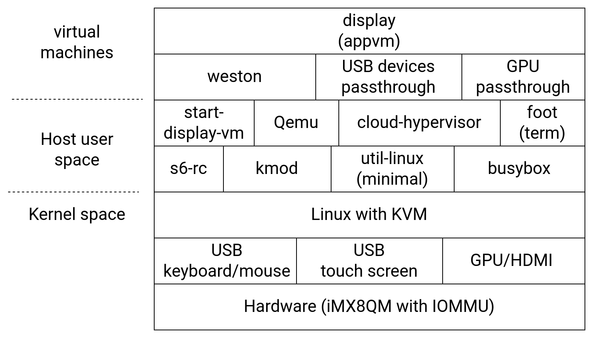

# Spectrum OS with GPU passthrough on DisplayVM

The canonical URL for the upstream Spectrum git repository is
<https://spectrum-os.org/git/spectrum/>.

To try Spectrum OS, you need to build it from the source and then install it to an SD card.

> Cross-compiled version of Spectrum OS is for iMX8QM board only with display VM.

This document describes how the GPU passthrough works with the display guest virtual machine (VM) in Spectrum OS. The next diagram shows the system's main components. First, we have a VM called **appvm-display**. This VM has a passthrough connection to the iMX8QM hardware. For this case, the GPU/HDMI for display output, and the USB human interface input (for this case USB keyboard/mouse and touchscreen). 

The weston/wayland desktop was moved from the host to the display VM. Then the display VM is able to generate all display output directly to the HDMI using the GPU drivers and the GPU passthrough. Also, this VM captupres the human interface devices through the USB passthrough for keyboard/mouse and touch screen. 

On the **Host user space** we have removed weston, in order that all graphics are managed by the display VM. Also, Qemu was added, due the current version of the display VM does not support GPU passthrough using cloud-hypervisor. A **start-dispaly-vm** script was added to launch the display VM.

On the hardware side, an HDMI LCD touch screen was connected to the iMX8QM HDMI TX port. Also, a USB type C hub was connected to the USB OTG port. In this hub a keyboard/mouse combo was connected alongside the USB for the LCD's touch screen.

## Building a Spectrum OS Image

Clone sources of spec and nix-spec (cross-compile branches for i.MX 8QXP):

	$ git clone -b display_passthrough https://github.com/ruizjuanpablo/nixpkgs-spectrum.git
    $ git clone -b display_passthrough https://github.com/ruizjuanpablo/spectrum.git

Set up the Spectrum binary cache as described on: <https://github.com/tiiuae/spectrum/tree/aarch64-imx8-crosscompile#readme>

To build the image utilizing binary-cache, run:

	$ NIXPKGS_ALLOW_UNFREE=1 nix-build spectrum/img/imx8qm/ -I nixpkgs=nixpkgs-spectrum --option substituters http://binarycache.vedenemo.dev

## Installing Spectrum OS

Before installation:

* Prepare an 8GB or more SD card.
* Make sure that the iMX8QM board is configured to boot from an SD card.
* Copy the downloaded or generated image to your SD card to create bootable media:

	  $ sudo dd if=spectrum-live.img of=/dev/sdx bs=1M conv=fsync

	Change **sdx** to match the one used by the SD card.

## Running the display VM

* Insert the SD card to the iMX8QM board
* Connect the HDMI LCD touch screen to the HDMI TX port on the iMX8QM board
* Connect the USB type C hub to the iMX8QM USB OTG port, and connect to the hub a keyboard/mouse combo and a use cable to the HDMI LCD touch screen. 
* Power on the board (Note: the board should be off for at least 10 seconds before bootup)
* After Specturn is launched, run the display VM by running the following command from the iMX8QM serial console:

	  # start-display-vm

* You will see weston/wayland started on the HDMI LCD screen. Here you can use the USB keyboard/mouse and the touchscreen. 

* To launch the 3D demos, open the terminal on the HDMI LCD screen. In that terminal with the USB keyboard run the next commands:

	  # cd /nix/store/0g5xbpi2p609b5h4x5cx1lkjl7znklbj-imx-gpu-viv-aarch64-unknown-linux-gnu-6.4.3.p4.2/opt/viv_samples/vdk/
	  # ./tutorial3_es20

